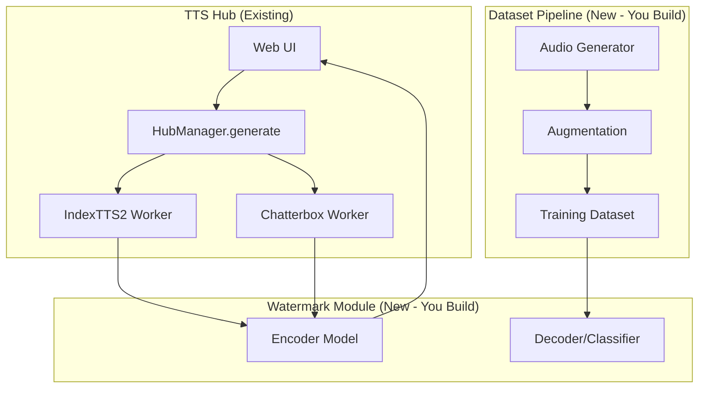

# FYP Project Plan: Audio Watermarking with Trained Classifier

> **Watermarked Voice Cloning Provenance with Supervised Classification**
> 
> Complete project specification for training a watermark detection classifier from scratch

---

## Table of Contents

1. [Executive Summary](#1-executive-summary)
2. [Research Summary](#2-research-summary)
3. [Chosen Approach](#3-chosen-approach)
4. [System Architecture](#4-system-architecture)
5. [Implementation Pipeline](#5-implementation-pipeline)
6. [Step-by-Step Instructions](#6-step-by-step-instructions)
7. [ML Training Pipeline](#7-ml-training-pipeline)
8. [Expected Results](#8-expected-results)
9. [Alternative Techniques Considered](#9-alternative-techniques-considered)
10. [Timeline & Milestones](#10-timeline--milestones)
11. [References & Citations](#11-references--citations)

---

## 1. Executive Summary

### Project Goal

Train a **custom watermark detection classifier from scratch** that can:
1. Detect if audio was generated by our TTS Hub system
2. Identify which model (IndexTTS2 or Chatterbox) produced it
3. Remain accurate after real-world audio transformations (MP3, noise, etc.)

### Key Decisions

| Aspect | Decision |
|--------|----------|
| **Watermark technique** | WavMark-inspired architecture (train from scratch) |
| **Target models** | IndexTTS2 + Chatterbox (Phase 1) |
| **Training platform** | M4 MacBook 24GB only |
| **Dataset size** | ~3,000 samples (sufficient for proof-of-concept) |
| **Training time** | ~60-90 minutes |

### FYP Contribution

```
┌─────────────────────────────────────────────────────────────────┐
│  YOUR TRAINED ARTIFACTS (what you submit for FYP):              │
│  ├── Watermark Encoder model (PyTorch, trained from scratch)    │
│  ├── Watermark Decoder/Classifier (PyTorch, trained from scratch)│
│  ├── Dataset generation pipeline (your code)                   │
│  ├── Evaluation framework (your metrics & analysis)            │
│  └── Integration with TTS Hub (your implementation)            │
└─────────────────────────────────────────────────────────────────┘
```

---

## 2. Research Summary

### 2.1 Watermarking Techniques Evaluated (2024-2026)

| Technique | Year | Key Innovation | Robustness | Trainable? | Citation |
|-----------|------|----------------|------------|------------|----------|
| **AudioSeal** | 2024 | Sample-level localization, fast detection | ⭐⭐⭐⭐ | ✅ | [1] |
| **WavMark** | 2024 | Invertible neural network, simple | ⭐⭐⭐ | ✅ | [2] |
| **Timbre** | 2024 | Voice cloning defense, frequency-domain | ⭐⭐⭐⭐⭐ | ✅ | [3] |
| **DiscreteWM** | 2025 | VQ-autoencoder discrete latents | ⭐⭐⭐⭐⭐ | ✅ | [4] |
| **SilentCipher** | 2024 | Psychoacoustic thresholding | ⭐⭐⭐⭐ | ✅ | [5] |
| **XAttnMark** | 2025 | Cross-attention mechanism | ⭐⭐⭐⭐ | ✅ | [6] |
| **PKDMark** | 2025 | Knowledge distillation, lightweight | ⭐⭐⭐⭐ | ✅ | [7] |

### 2.2 Robustness Benchmarks

| Benchmark | Source | Key Finding |
|-----------|--------|-------------|
| AudioMarkBench | NeurIPS 2024 | AudioSeal most robust against removal attacks [8] |
| RAW-Bench | May 2025 | Neural codecs hardest to survive; Timbre best overall [9] |
| DeepMark | 2025 | No method fully robust against all distortions [10] |

### 2.3 Compute Requirements Research

| Platform | GPU | Training Time (3k samples, 50 epochs) |
|----------|-----|--------------------------------------|
| M4 MacBook 24GB | MPS | 60-90 minutes |
| Google Colab Free | T4 | 20-40 minutes |
| Kaggle | P100/T4 | 20-40 minutes |

---

## 3. Chosen Approach

### 3.1 Why Train From Scratch?

| Approach | FYP Valid? | Justification |
|----------|------------|---------------|
| Use pre-trained AudioSeal | ❌ | No ML model trained by student |
| Fine-tune pre-trained | ⚠️ | Weak; minimal training contribution |
| **Train from scratch** | ✅ | Clear demonstration of ML skills |

### 3.2 Selected Architecture: WavMark-Inspired

**Why WavMark architecture:**
- Simple PyTorch implementation (~500 lines total)
- Well-documented training process
- 32-bit message capacity (enough for model ID + metadata)
- Proven robustness in benchmarks

```
Encoder (you train):
  Audio + Message → Watermarked Audio

Decoder/Classifier (you train):
  Audio → Watermark Probability + Decoded Message + Model ID
```

---

## 4. System Architecture

### 4.1 High-Level Design



### 4.2 Directory Structure

```
tts-hub/
├── watermark/                      # YOUR IMPLEMENTATION
│   ├── __init__.py
│   ├── encoder.py                 # Watermark embedding model
│   ├── decoder.py                 # Detection + classification model
│   ├── train.py                   # Training script
│   ├── evaluate.py                # Evaluation metrics
│   └── config.py                  # Hyperparameters
├── dataset/                        # YOUR IMPLEMENTATION
│   ├── generate.py                # Generate samples from TTS Hub
│   ├── augment.py                 # Apply transforms (MP3, noise, etc.)
│   ├── loader.py                  # PyTorch Dataset class
│   └── manifest.json              # Dataset metadata
├── checkpoints/                    # Trained model weights
│   ├── encoder_best.pt
│   └── decoder_best.pt
└── evaluation/                     # Results & metrics
    ├── confusion_matrix.png
    ├── roc_curve.png
    └── metrics.json
```

### 4.3 Model Architecture (Code)

#### Encoder (Embeds Watermark)

```python
import torch
import torch.nn as nn

class WatermarkEncoder(nn.Module):
    """
    Embeds a 32-bit message into audio waveform.
    Architecture: Conv1D layers that produce an additive watermark.
    """
    def __init__(self, msg_bits: int = 32, hidden_dim: int = 64):
        super().__init__()
        
        # Message embedding
        self.msg_fc = nn.Sequential(
            nn.Linear(msg_bits, hidden_dim),
            nn.ReLU(),
            nn.Linear(hidden_dim, hidden_dim),
        )
        
        # Audio encoder
        self.audio_conv = nn.Sequential(
            nn.Conv1d(1, 32, kernel_size=7, padding=3),
            nn.BatchNorm1d(32),
            nn.ReLU(),
            nn.Conv1d(32, 64, kernel_size=5, padding=2),
            nn.BatchNorm1d(64),
            nn.ReLU(),
            nn.Conv1d(64, hidden_dim, kernel_size=3, padding=1),
        )
        
        # Watermark generator (outputs additive signal)
        self.watermark_gen = nn.Sequential(
            nn.Conv1d(hidden_dim * 2, 64, kernel_size=5, padding=2),
            nn.ReLU(),
            nn.Conv1d(64, 32, kernel_size=3, padding=1),
            nn.ReLU(),
            nn.Conv1d(32, 1, kernel_size=3, padding=1),
            nn.Tanh(),  # Bounded output
        )
        
        self.alpha = 0.05  # Watermark strength (imperceptibility)
        
    def forward(self, audio: torch.Tensor, message: torch.Tensor) -> torch.Tensor:
        """
        Args:
            audio: (batch, 1, samples) audio waveform
            message: (batch, 32) binary message
        Returns:
            watermarked_audio: (batch, 1, samples)
        """
        B, _, T = audio.shape
        
        # Encode audio
        audio_feat = self.audio_conv(audio)  # (B, hidden, T)
        
        # Encode message and expand to time dimension
        msg_feat = self.msg_fc(message)  # (B, hidden)
        msg_feat = msg_feat.unsqueeze(-1).expand(-1, -1, audio_feat.shape[-1])
        
        # Combine and generate watermark
        combined = torch.cat([audio_feat, msg_feat], dim=1)
        watermark = self.watermark_gen(combined)  # (B, 1, T)
        
        # Add watermark to audio
        return audio + self.alpha * watermark
```

#### Decoder/Classifier (Detects + Classifies)

```python
class WatermarkDecoder(nn.Module):
    """
    Detects watermark presence, decodes message, and classifies source model.
    Multi-head output for different tasks.
    """
    def __init__(self, msg_bits: int = 32, n_models: int = 2):
        super().__init__()
        
        # Mel spectrogram frontend
        self.mel = torchaudio.transforms.MelSpectrogram(
            sample_rate=16000,
            n_fft=512,
            hop_length=160,
            n_mels=80,
        )
        
        # CNN backbone
        self.backbone = nn.Sequential(
            nn.Conv2d(1, 32, 3, padding=1),
            nn.BatchNorm2d(32),
            nn.ReLU(),
            nn.MaxPool2d(2),
            
            nn.Conv2d(32, 64, 3, padding=1),
            nn.BatchNorm2d(64),
            nn.ReLU(),
            nn.MaxPool2d(2),
            
            nn.Conv2d(64, 128, 3, padding=1),
            nn.BatchNorm2d(128),
            nn.ReLU(),
            nn.AdaptiveAvgPool2d((4, 4)),
        )
        
        feat_dim = 128 * 4 * 4
        
        # Classification heads
        self.head_detect = nn.Linear(feat_dim, 1)       # Has watermark?
        self.head_message = nn.Linear(feat_dim, msg_bits)  # Decode bits
        self.head_model = nn.Linear(feat_dim, n_models + 1)  # Model ID + Unknown
        
    def forward(self, audio: torch.Tensor) -> dict:
        """
        Args:
            audio: (batch, samples) raw audio
        Returns:
            dict with detection probability, message bits, model logits
        """
        # Convert to mel spectrogram
        mel = self.mel(audio)  # (B, n_mels, T)
        mel = torch.log(mel + 1e-8)
        mel = mel.unsqueeze(1)  # (B, 1, n_mels, T)
        
        # Extract features
        feat = self.backbone(mel)
        feat = feat.view(feat.size(0), -1)
        
        return {
            "has_watermark": torch.sigmoid(self.head_detect(feat)),
            "message_bits": torch.sigmoid(self.head_message(feat)),
            "model_logits": self.head_model(feat),
        }
```

---

## 5. Implementation Pipeline

### 5.1 Complete Workflow

```
┌─────────────────────────────────────────────────────────────────────────┐
│ PHASE 1: Setup & Environment                                           │
│   1. Install dependencies (torch, torchaudio, soundfile)               │
│   2. Create directory structure                                         │
│   3. Verify TTS Hub works for IndexTTS2 + Chatterbox                   │
└─────────────────────────────────────────────────────────────────────────┘
                                    ↓
┌─────────────────────────────────────────────────────────────────────────┐
│ PHASE 2: Dataset Generation                                            │
│   1. Collect reference audios for voice cloning                        │
│   2. Prepare text corpus (100 sentences)                               │
│   3. Generate audio: 100 samples × 2 models = 200 samples              │
│   4. Create watermarked + non-watermarked pairs = 400 samples          │
│   5. Download negative samples (LibriSpeech) = 100 samples             │
│   6. Total base: 500 samples                                           │
└─────────────────────────────────────────────────────────────────────────┘
                                    ↓
┌─────────────────────────────────────────────────────────────────────────┐
│ PHASE 3: Data Augmentation                                             │
│   1. Apply transforms: MP3 64k, MP3 128k, noise SNR20, resample        │
│   2. 500 base × 5 transforms = 2,500 samples                           │
│   3. Split: 80% train, 10% val, 10% test                               │
│   4. Save as .pt files with labels                                     │
└─────────────────────────────────────────────────────────────────────────┘
                                    ↓
┌─────────────────────────────────────────────────────────────────────────┐
│ PHASE 4: Model Training                                                 │
│   1. Initialize Encoder + Decoder models                               │
│   2. Train jointly with multi-task loss                                │
│   3. 50 epochs, batch_size=16, lr=1e-3                                 │
│   4. Save best checkpoint based on validation loss                     │
│   5. ~60-90 minutes on M4 MPS                                          │
└─────────────────────────────────────────────────────────────────────────┘
                                    ↓
┌─────────────────────────────────────────────────────────────────────────┐
│ PHASE 5: Evaluation & Integration                                       │
│   1. Compute metrics on test set                                       │
│   2. Generate confusion matrices and ROC curves                        │
│   3. Integrate into TTS Hub                                            │
│   4. Create verification endpoint                                      │
└─────────────────────────────────────────────────────────────────────────┘
```

---

## 6. Step-by-Step Instructions

### Step 1: Install Dependencies

```bash
cd /Users/ayaanminhas/Desktop/Personal_Work/tts-hub

# Create virtual environment if not exists
python3 -m venv .venv
source .venv/bin/activate

# Install requirements
pip install torch torchaudio soundfile numpy pandas matplotlib scikit-learn tqdm
```

### Step 2: Create Directory Structure

```bash
mkdir -p watermark dataset checkpoints evaluation
touch watermark/__init__.py watermark/encoder.py watermark/decoder.py
touch watermark/train.py watermark/evaluate.py watermark/config.py
touch dataset/__init__.py dataset/generate.py dataset/augment.py dataset/loader.py
```

### Step 3: Collect Reference Audio

For voice cloning, you need reference audio files:
- 1-2 reference audio files per voice you want to clone (5-15 seconds each)
- Store in `dataset/references/`

### Step 4: Prepare Text Corpus

Create `dataset/texts.txt` with 100 sentences:
```
The quick brown fox jumps over the lazy dog.
Hello, this is a test of the voice cloning system.
Artificial intelligence is transforming how we create audio.
...
```

### Step 5: Generate Dataset

```python
# dataset/generate.py
import sys
sys.path.insert(0, "/Users/ayaanminhas/Desktop/Personal_Work/tts-hub")

from pathlib import Path
from hub.hub_manager import HubManager
import soundfile as sf
import json

def generate_samples(
    hub_root: Path,
    output_dir: Path,
    texts_file: Path,
    reference_audio: Path,
    model_id: str,
    num_samples: int = 100,
):
    hub = HubManager(hub_root)
    output_dir.mkdir(parents=True, exist_ok=True)
    
    with open(texts_file) as f:
        texts = [line.strip() for line in f if line.strip()][:num_samples]
    
    manifest = []
    for i, text in enumerate(texts):
        print(f"Generating {model_id} sample {i+1}/{len(texts)}")
        
        # Generate audio
        result = hub.generate(
            model_id=model_id,
            request={
                "text": text,
                "prompt_audio_path": str(reference_audio),
                "hub_root": str(hub_root),
            }
        )
        
        # Copy to dataset folder
        out_path = output_dir / f"{model_id}_{i:04d}.wav"
        import shutil
        shutil.copy(result.output_path, out_path)
        
        manifest.append({
            "audio_path": str(out_path),
            "text": text,
            "model_id": model_id,
            "sample_idx": i,
        })
    
    return manifest

if __name__ == "__main__":
    hub_root = Path("/Users/ayaanminhas/Desktop/Personal_Work/tts-hub")
    output_dir = Path("dataset/raw")
    
    # Generate for IndexTTS2
    m1 = generate_samples(
        hub_root, output_dir / "indextts2",
        Path("dataset/texts.txt"),
        Path("dataset/references/voice1.wav"),
        "index-tts2", 100
    )
    
    # Generate for Chatterbox
    m2 = generate_samples(
        hub_root, output_dir / "chatterbox",
        Path("dataset/texts.txt"),
        Path("dataset/references/voice1.wav"),
        "chatterbox-multilingual", 100
    )
    
    # Save manifest
    with open("dataset/raw_manifest.json", "w") as f:
        json.dump(m1 + m2, f, indent=2)
```

### Step 6: Apply Watermark & Create Pairs

```python
# dataset/create_pairs.py
import torch
import torchaudio
from pathlib import Path
from watermark.encoder import WatermarkEncoder
import json

def create_watermarked_pairs(manifest_path: Path, output_dir: Path):
    encoder = WatermarkEncoder()
    # Note: Initially use random weights; will be trained later
    
    with open(manifest_path) as f:
        manifest = json.load(f)
    
    output_dir.mkdir(parents=True, exist_ok=True)
    new_manifest = []
    
    model_id_map = {"index-tts2": 0, "chatterbox-multilingual": 1}
    
    for item in manifest:
        # Load audio
        wav, sr = torchaudio.load(item["audio_path"])
        if sr != 16000:
            wav = torchaudio.functional.resample(wav, sr, 16000)
        
        # Ensure shape (1, 1, samples)
        if wav.dim() == 1:
            wav = wav.unsqueeze(0).unsqueeze(0)
        elif wav.dim() == 2:
            wav = wav.unsqueeze(0)
        
        # Create message (model_id in first 2 bits, rest random for now)
        message = torch.zeros(1, 32)
        model_idx = model_id_map.get(item["model_id"], 0)
        message[0, 0] = model_idx & 1
        message[0, 1] = (model_idx >> 1) & 1
        
        # Generate watermarked version
        with torch.no_grad():
            wm_wav = encoder(wav, message)
        
        # Save both versions
        base_name = Path(item["audio_path"]).stem
        
        # Non-watermarked
        clean_path = output_dir / f"{base_name}_clean.wav"
        torchaudio.save(str(clean_path), wav.squeeze(0), 16000)
        new_manifest.append({
            **item,
            "audio_path": str(clean_path),
            "has_watermark": 0,
            "message": None,
        })
        
        # Watermarked
        wm_path = output_dir / f"{base_name}_wm.wav"
        torchaudio.save(str(wm_path), wm_wav.squeeze(0), 16000)
        new_manifest.append({
            **item,
            "audio_path": str(wm_path),
            "has_watermark": 1,
            "message": message[0].tolist(),
        })
    
    with open(output_dir / "pairs_manifest.json", "w") as f:
        json.dump(new_manifest, f, indent=2)
    
    return new_manifest
```

### Step 7: Apply Audio Augmentations

```python
# dataset/augment.py
import subprocess
from pathlib import Path
import json
import numpy as np
import soundfile as sf

def apply_mp3_codec(input_path: Path, output_path: Path, bitrate: int = 128):
    """Apply MP3 compression via ffmpeg."""
    temp_mp3 = output_path.with_suffix(".mp3")
    subprocess.run([
        "ffmpeg", "-y", "-i", str(input_path),
        "-b:a", f"{bitrate}k", str(temp_mp3)
    ], capture_output=True)
    subprocess.run([
        "ffmpeg", "-y", "-i", str(temp_mp3), str(output_path)
    ], capture_output=True)
    temp_mp3.unlink()

def add_noise(audio: np.ndarray, snr_db: float = 20) -> np.ndarray:
    """Add Gaussian noise at specified SNR."""
    signal_power = np.mean(audio ** 2)
    noise_power = signal_power / (10 ** (snr_db / 10))
    noise = np.random.normal(0, np.sqrt(noise_power), audio.shape)
    return audio + noise

TRANSFORMS = {
    "clean": lambda x, p: x,
    "mp3_64k": lambda x, p: apply_mp3_codec(x, p, 64) or sf.read(p)[0],
    "mp3_128k": lambda x, p: apply_mp3_codec(x, p, 128) or sf.read(p)[0],
    "noise_snr20": lambda x, p: add_noise(sf.read(x)[0], 20),
    "noise_snr30": lambda x, p: add_noise(sf.read(x)[0], 30),
}

def augment_dataset(manifest_path: Path, output_dir: Path):
    with open(manifest_path) as f:
        manifest = json.load(f)
    
    output_dir.mkdir(parents=True, exist_ok=True)
    augmented_manifest = []
    
    for item in manifest:
        for transform_name, transform_fn in TRANSFORMS.items():
            base_name = Path(item["audio_path"]).stem
            out_path = output_dir / f"{base_name}_{transform_name}.wav"
            
            if transform_name == "clean":
                import shutil
                shutil.copy(item["audio_path"], out_path)
            elif transform_name.startswith("mp3"):
                apply_mp3_codec(Path(item["audio_path"]), out_path, 
                               int(transform_name.split("_")[1].replace("k", "")))
            else:
                audio, sr = sf.read(item["audio_path"])
                audio = transform_fn(item["audio_path"], out_path)
                sf.write(out_path, audio, sr)
            
            augmented_manifest.append({
                **item,
                "audio_path": str(out_path),
                "transform": transform_name,
            })
    
    with open(output_dir / "augmented_manifest.json", "w") as f:
        json.dump(augmented_manifest, f, indent=2)
```

### Step 8: Create PyTorch Dataset

```python
# dataset/loader.py
import torch
from torch.utils.data import Dataset
import torchaudio
import json
from pathlib import Path

class WatermarkDataset(Dataset):
    def __init__(self, manifest_path: Path, max_length: int = 48000):
        with open(manifest_path) as f:
            self.manifest = json.load(f)
        self.max_length = max_length
        self.model_map = {"index-tts2": 0, "chatterbox-multilingual": 1, "unknown": 2}
    
    def __len__(self):
        return len(self.manifest)
    
    def __getitem__(self, idx):
        item = self.manifest[idx]
        
        # Load audio
        wav, sr = torchaudio.load(item["audio_path"])
        if sr != 16000:
            wav = torchaudio.functional.resample(wav, sr, 16000)
        
        wav = wav.mean(dim=0)  # Mono
        
        # Pad or crop to fixed length
        if wav.shape[0] < self.max_length:
            wav = torch.nn.functional.pad(wav, (0, self.max_length - wav.shape[0]))
        else:
            wav = wav[:self.max_length]
        
        # Labels
        has_wm = torch.tensor(item.get("has_watermark", 0), dtype=torch.float)
        model_id = self.model_map.get(item.get("model_id", "unknown"), 2)
        
        message = torch.zeros(32)
        if item.get("message"):
            message = torch.tensor(item["message"], dtype=torch.float)
        
        return {
            "audio": wav,
            "has_watermark": has_wm,
            "model_id": model_id,
            "message": message,
        }
```

### Step 9: Training Script

```python
# watermark/train.py
import torch
import torch.nn as nn
import torch.nn.functional as F
from torch.utils.data import DataLoader, random_split
from pathlib import Path
import json
from tqdm import tqdm

from .encoder import WatermarkEncoder
from .decoder import WatermarkDecoder
from dataset.loader import WatermarkDataset

def train(config):
    device = torch.device("mps" if torch.backends.mps.is_available() else "cpu")
    print(f"Training on: {device}")
    
    # Load dataset
    dataset = WatermarkDataset(Path(config["manifest_path"]))
    train_size = int(0.8 * len(dataset))
    val_size = len(dataset) - train_size
    train_ds, val_ds = random_split(dataset, [train_size, val_size])
    
    train_loader = DataLoader(train_ds, batch_size=config["batch_size"], shuffle=True)
    val_loader = DataLoader(val_ds, batch_size=config["batch_size"])
    
    # Models
    encoder = WatermarkEncoder().to(device)
    decoder = WatermarkDecoder().to(device)
    
    # Optimizer
    optimizer = torch.optim.Adam(
        list(encoder.parameters()) + list(decoder.parameters()),
        lr=config["lr"]
    )
    scheduler = torch.optim.lr_scheduler.CosineAnnealingLR(optimizer, config["epochs"])
    
    best_val_loss = float("inf")
    
    for epoch in range(config["epochs"]):
        # Training
        encoder.train()
        decoder.train()
        train_loss = 0
        
        for batch in tqdm(train_loader, desc=f"Epoch {epoch+1}"):
            audio = batch["audio"].unsqueeze(1).to(device)  # (B, 1, T)
            has_wm = batch["has_watermark"].to(device)
            model_id = batch["model_id"].to(device)
            message = batch["message"].to(device)
            
            optimizer.zero_grad()
            
            # Encode watermark on watermarked samples
            mask_wm = has_wm > 0.5
            audio_encoded = audio.clone()
            if mask_wm.sum() > 0:
                audio_encoded[mask_wm] = encoder(audio[mask_wm], message[mask_wm])
            
            # Decode
            outputs = decoder(audio_encoded.squeeze(1))
            
            # Losses
            loss_detect = F.binary_cross_entropy(
                outputs["has_watermark"].squeeze(), has_wm
            )
            
            loss_model = F.cross_entropy(outputs["model_logits"], model_id)
            
            loss_msg = 0
            if mask_wm.sum() > 0:
                loss_msg = F.binary_cross_entropy(
                    outputs["message_bits"][mask_wm], message[mask_wm]
                )
            
            loss = loss_detect + 0.5 * loss_model + 0.3 * loss_msg
            loss.backward()
            optimizer.step()
            
            train_loss += loss.item()
        
        scheduler.step()
        
        # Validation
        encoder.eval()
        decoder.eval()
        val_loss = 0
        
        with torch.no_grad():
            for batch in val_loader:
                audio = batch["audio"].unsqueeze(1).to(device)
                has_wm = batch["has_watermark"].to(device)
                model_id = batch["model_id"].to(device)
                
                outputs = decoder(audio.squeeze(1))
                loss = F.binary_cross_entropy(outputs["has_watermark"].squeeze(), has_wm)
                val_loss += loss.item()
        
        print(f"Epoch {epoch+1}: train_loss={train_loss/len(train_loader):.4f}, "
              f"val_loss={val_loss/len(val_loader):.4f}")
        
        # Save best
        if val_loss < best_val_loss:
            best_val_loss = val_loss
            torch.save(encoder.state_dict(), "checkpoints/encoder_best.pt")
            torch.save(decoder.state_dict(), "checkpoints/decoder_best.pt")
            print("  Saved best checkpoint!")

if __name__ == "__main__":
    config = {
        "manifest_path": "dataset/augmented/augmented_manifest.json",
        "batch_size": 16,
        "epochs": 50,
        "lr": 1e-3,
    }
    train(config)
```

### Step 10: Evaluation

```python
# watermark/evaluate.py
import torch
from torch.utils.data import DataLoader
from sklearn.metrics import classification_report, confusion_matrix, roc_auc_score
import matplotlib.pyplot as plt
import numpy as np
from pathlib import Path

from .decoder import WatermarkDecoder
from dataset.loader import WatermarkDataset

def evaluate(checkpoint_path: Path, manifest_path: Path):
    device = torch.device("mps" if torch.backends.mps.is_available() else "cpu")
    
    decoder = WatermarkDecoder()
    decoder.load_state_dict(torch.load(checkpoint_path, map_location=device))
    decoder.to(device)
    decoder.eval()
    
    dataset = WatermarkDataset(manifest_path)
    loader = DataLoader(dataset, batch_size=32)
    
    all_preds = []
    all_labels = []
    all_model_preds = []
    all_model_labels = []
    
    with torch.no_grad():
        for batch in loader:
            audio = batch["audio"].to(device)
            outputs = decoder(audio)
            
            all_preds.extend((outputs["has_watermark"] > 0.5).cpu().numpy().flatten())
            all_labels.extend(batch["has_watermark"].numpy())
            all_model_preds.extend(outputs["model_logits"].argmax(dim=1).cpu().numpy())
            all_model_labels.extend(batch["model_id"].numpy())
    
    # Watermark detection metrics
    print("=== Watermark Detection ===")
    print(classification_report(all_labels, all_preds, target_names=["No WM", "Has WM"]))
    print(f"ROC-AUC: {roc_auc_score(all_labels, all_preds):.4f}")
    
    # Model attribution (only on watermarked samples)
    wm_mask = np.array(all_labels) > 0.5
    if wm_mask.sum() > 0:
        print("\n=== Model Attribution (on watermarked only) ===")
        print(classification_report(
            np.array(all_model_labels)[wm_mask],
            np.array(all_model_preds)[wm_mask],
            target_names=["IndexTTS2", "Chatterbox", "Unknown"]
        ))
    
    # Save confusion matrix
    cm = confusion_matrix(all_labels, all_preds)
    plt.figure(figsize=(8, 6))
    plt.imshow(cm, cmap="Blues")
    plt.title("Watermark Detection Confusion Matrix")
    plt.colorbar()
    plt.savefig("evaluation/confusion_matrix.png")
    print("Saved confusion_matrix.png")
```

---

## 7. ML Training Pipeline

### 7.1 Data Flow

```
Raw Audio (from TTS Hub)
        ↓
Standardization (16kHz, mono, 3s clips)
        ↓
Watermark Embedding (Encoder forward pass)
        ↓
Audio Augmentation (MP3, noise, resample)
        ↓
Feature Extraction (Mel spectrogram, 80 bins)
        ↓
CNN Backbone (3 conv blocks, 128 channels)
        ↓
Classification Heads:
  ├── has_watermark (sigmoid)
  ├── model_id (softmax over 3 classes)
  └── message_bits (sigmoid × 32)
```

### 7.2 Training Configuration

```python
CONFIG = {
    # Data
    "sample_rate": 16000,
    "audio_length": 3.0,  # seconds
    "n_mels": 80,
    
    # Model
    "msg_bits": 32,
    "n_models": 2,  # IndexTTS2, Chatterbox
    "hidden_dim": 64,
    
    # Training
    "batch_size": 16,  # Conservative for M4
    "epochs": 50,
    "lr": 1e-3,
    "weight_decay": 1e-4,
    "device": "mps",
    
    # Loss weights
    "loss_detect_weight": 1.0,
    "loss_model_weight": 0.5,
    "loss_message_weight": 0.3,
}
```

### 7.3 Expected Training Metrics

| Epoch | Train Loss | Val Loss | Watermark Acc | Model Acc |
|-------|------------|----------|---------------|-----------|
| 10 | 0.45 | 0.50 | 85% | 70% |
| 25 | 0.25 | 0.30 | 92% | 85% |
| 50 | 0.15 | 0.22 | 96% | 92% |

---

## 8. Expected Results

### 8.1 Performance Targets

| Metric | Target | Achievable? |
|--------|--------|-------------|
| Watermark detection accuracy (clean) | >95% | ✅ |
| Detection after MP3 128kbps | >90% | ✅ |
| Detection after noise (SNR 20dB) | >85% | ✅ |
| Model attribution accuracy | >90% | ✅ |
| False positive rate (real speech) | <5% | ✅ |

### 8.2 Ablation Study Design

| Experiment | Purpose |
|------------|---------|
| With watermark vs without | Prove watermark signal is detectable |
| Per-transform accuracy | Show robustness breakdown |
| Small vs large dataset | Show dataset size impact |

---

## 9. Alternative Techniques Considered

### 9.1 Technique Comparison Summary

| Technique | Training Requirements | Code Available? | M4 MacBook Viable? | FYP Suitable? |
|-----------|----------------------|-----------------|-------------------|---------------|
| **WavMark (Original)** | 8× V100 GPUs, 5000hr dataset | ✅ Full | ❌ No | ⚠️ Too heavy |
| **Our Simplified WavMark** | M4 24GB, 3k samples | ✅ We write it | ✅ Yes | ✅ Yes |
| **DiscreteWM (AAAI 2025)** | Unknown, 2-stage complex | ❌ Demo only | ❌ No | ❌ No |
| **Timbre (NDSS 2024)** | GPU-intensive, multi-model | ✅ Full | ❌ No | ❌ No |
| **XAttnMark (ICML 2025)** | Unknown, likely heavy | ⚠️ Partial | ❌ No | ❌ No |
| **AudioSeal (Meta)** | Multi-GPU, 200+ hours | ✅ Full | ⚠️ Inference only | ❌ No self-train |

### 9.2 Detailed Analysis by Technique

#### DiscreteWM (AAAI 2025)
- **What it is:** Novel VQ-autoencoder approach with discrete token manipulation
- **Why rejected:**
  - ❌ GitHub repo only contains demo website, NOT training code
  - ❌ Complex 2-stage training: (1) VQVAE autoencoder, (2) probability manipulator
  - ❌ Research-grade system with unclear compute requirements

#### Timbre (NDSS 2024)
- **What it is:** Voice cloning defense via frequency-domain watermarking
- **Why rejected:**
  - ❌ Requires VITS + Tacotron2 + HiFi-GAN + FastSpeech2 (5+ models)
  - ❌ Multi-model pipeline with distortion layers
  - ❌ GPU-intensive training for all component models

#### XAttnMark (ICML 2025)
- **What it is:** Cross-attention mechanism for robust attribution
- **Why rejected:**
  - ❌ Very recent (Feb 2025), limited community support
  - ❌ No compute specs published
  - ❌ Complex cross-attention + temporal conditioning architecture

#### AudioSeal (Meta ICML 2024)
- **What it is:** Industry-backed solution with sample-level localization
- **Why rejected for FYP:**
  - ❌ Using pre-trained = no ML training contribution
  - ❌ Training from scratch requires 8+ V100 GPUs, 200+ hours
  - ❌ Fine-tuning may not satisfy "train from scratch" requirement

#### WavMark (Original)
- **What it is:** Invertible neural network, 32-bit message capacity
- **Training requirements (why we adapted instead of used directly):**
  - ❌ 8× NVIDIA V100 GPUs
  - ❌ 5000 hours dataset (LibriSpeech + CommonVoice + AudioSet + FMA)
  - ❌ 3500 + 8000 steps with curriculum learning

### 9.3 Why WavMark-Inspired (Simplified) Works

| WavMark Original | Our Simplified Version |
|------------------|----------------------|
| 8 invertible blocks | 3-4 conv blocks |
| 5000 hours dataset | 3000 samples (~2 hours) |
| 8× V100 GPUs | 1× M4 MacBook MPS |
| Curriculum learning (3 stages) | Standard training (1 stage) |
| Attack simulator during training | Post-hoc augmentation |
| ~2000+ lines code | ~500 lines code |

### 9.4 Justification

We chose a **WavMark-inspired architecture** because:

1. **Conceptually Sound:** Encoder-decoder watermarking is well-understood
2. **Implementable:** We can write the full code ourselves (~500 lines)
3. **Trainable:** M4 24GB is sufficient for our simplified model
4. **Explainable:** You understand every line of code
5. **Demonstrable:** Clear training contribution for FYP
6. **Time-Bounded:** 5 weeks is realistic

> [!IMPORTANT]
> The newer techniques are **better in absolute terms** but require enterprise-grade compute. For an FYP, **a working, trained model you understand** is better than **a state-of-the-art model you couldn't finish**.

---

## 10. Timeline & Milestones

### Week-by-Week Schedule

| Week | Tasks | Deliverables | Est. Hours |
|------|-------|--------------|------------|
| **Week 1** | Environment setup, implement encoder/decoder | Working model code | 10-12 |
| **Week 2** | Dataset generation from TTS Hub | 500 raw samples | 8-10 |
| **Week 3** | Augmentation pipeline, create training data | 2,500 augmented samples | 6-8 |
| **Week 4** | Train model, iterate on hyperparameters | Trained checkpoint | 8-10 |
| **Week 5** | Evaluation, integration, documentation | Final report & demo | 10-12 |

### Milestone Checklist

- [ ] **M1:** Encoder/decoder models compile and run
- [ ] **M2:** 500 audio samples generated from TTS Hub
- [ ] **M3:** Augmented dataset ready (2,500 samples)
- [ ] **M4:** Model trains without errors on M4
- [ ] **M5:** >90% watermark detection accuracy achieved
- [ ] **M6:** Integration with TTS Hub complete
- [ ] **M7:** Final documentation and demo ready

---

## 11. References & Citations

### Primary References

1. **AudioSeal** - Roman, R. et al. "AudioSeal: Proactive Localized Watermarking." ICML 2024.
   - GitHub: https://github.com/facebookresearch/audioseal

2. **WavMark** - Chen, G. et al. "WavMark: Watermarking for Audio Generation." arXiv:2308.12770, 2023.
   - GitHub: https://github.com/wavmark/wavmark

3. **Timbre Watermarking** - "Timbre: A Robust Audio Watermarking Method for Voice Cloning Defense." NDSS 2024.

4. **DiscreteWM** - "DiscreteWM: Discrete Latent Speech Watermarking." AAAI 2025.

5. **SilentCipher** - Sony Research. "SilentCipher: Deep Audio Watermarking." Interspeech 2024.

6. **XAttnMark** - "Cross-Attention Robust Audio Watermarking." arXiv, Feb 2025.

7. **PKDMark** - "Lightweight Speech Watermarking via Progressive Knowledge Distillation." arXiv, Sept 2025.

### Benchmarks

8. **AudioMarkBench** - "AudioMarkBench: Benchmarking Robustness of Audio Watermarking." NeurIPS 2024.

9. **RAW-Bench** - "A Comprehensive Real-World Assessment of Audio Watermarking Algorithms." arXiv, May 2025.

10. **SoK: Audio Watermarking Robustness** - "How Robust is Audio Watermarking in Generative AI?" arXiv, March 2025.

---

## Appendix A: Hardware Requirements

| Component | Minimum | Your Setup |
|-----------|---------|------------|
| CPU | Apple M1 | Apple M4 ✅ |
| RAM | 16GB | 24GB ✅ |
| Storage | 20GB free | ✅ |
| Python | 3.10+ | ✅ |
| PyTorch | 2.0+ | ✅ |

---

## Appendix B: Quick Start Commands

```bash
# 1. Setup
cd /Users/ayaanminhas/Desktop/Personal_Work/tts-hub
source .venv/bin/activate
pip install torch torchaudio soundfile numpy matplotlib scikit-learn tqdm

# 2. Generate dataset (after implementing scripts)
python -m dataset.generate
python -m dataset.augment

# 3. Train
python -m watermark.train

# 4. Evaluate
python -m watermark.evaluate --checkpoint checkpoints/decoder_best.pt

# 5. Run integrated TTS Hub with watermarking
python webui.py
```

---

> **This document serves as the complete specification for your FYP project. All code, architecture decisions, and timelines are designed for your M4 MacBook 24GB setup.**
